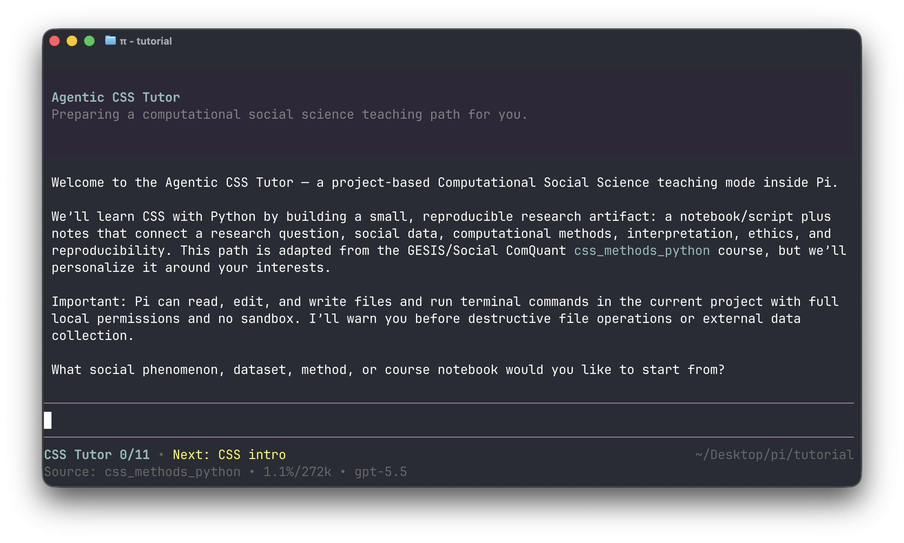

# Agentic CSS Tutor

This is an experimental [Pi](https://pi.dev) teaching-mode extension for an **Agentic Introduction to Computational Social Science with Python**.

Run it directly from GitHub with:

```bash
pi -e https://github.com/arnim/agentic-css-tutor
```

The curriculum is adapted from the public GESIS course repository:

<https://github.com/gesiscss/css_methods_python>

## Screenshot




## Files

```text
src/index.ts                         # Pi extension runtime: tools, UI, events, commands
src/curricula/types.ts               # curriculum data interfaces
src/curricula/css-methods-python.ts  # course map, sessions, milestones
src/prompts/css-tutor.ts             # prompt builders and formatting helpers
```

## Slash commands

- `/css-progress` — show completed and remaining tutor milestones.
- `/css-syllabus` — show the full adapted `css_methods_python` course map.
- `/css-syllabus A2` — show details for one source session.
- `/css-focus C3` — steer the tutor toward one source session.
- `/css-focus topic modeling` — steer the tutor toward a free-form topic.
- `/css-source` — show upstream course attribution/source.

## Notes

Pi extensions run with your local permissions. This tutor reminds the model to be careful before destructive operations, web scraping, external data collection, or anything that could affect privacy, platform terms, or local files.
